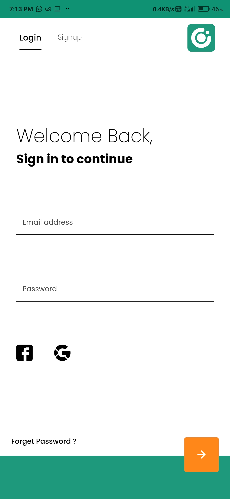
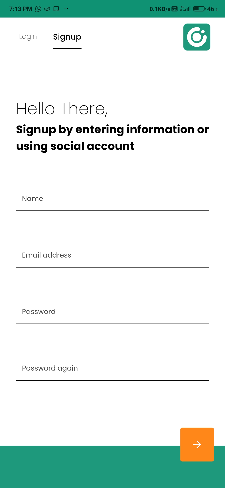
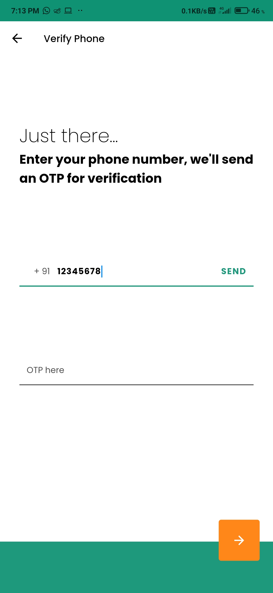
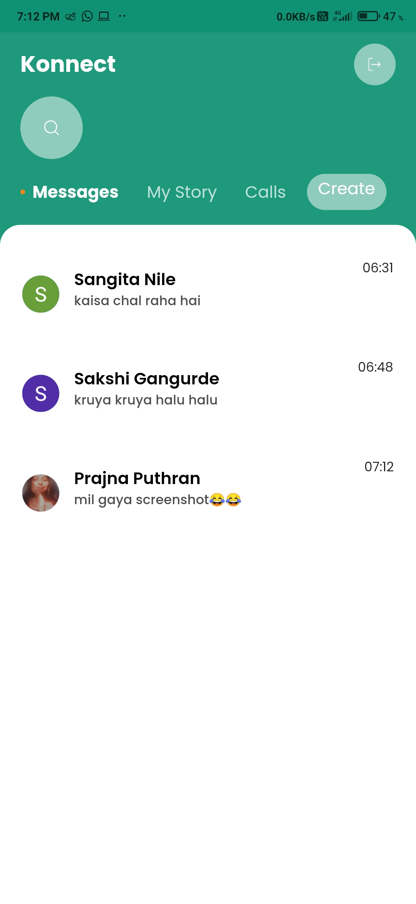
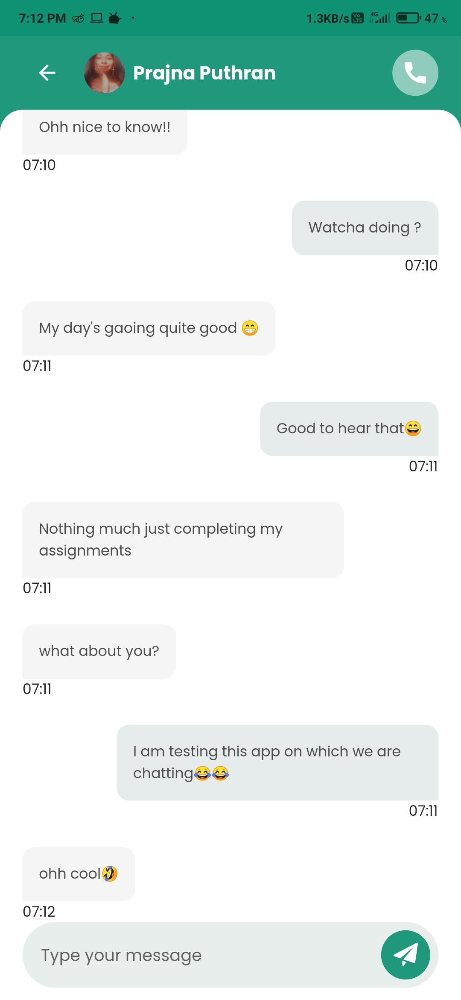
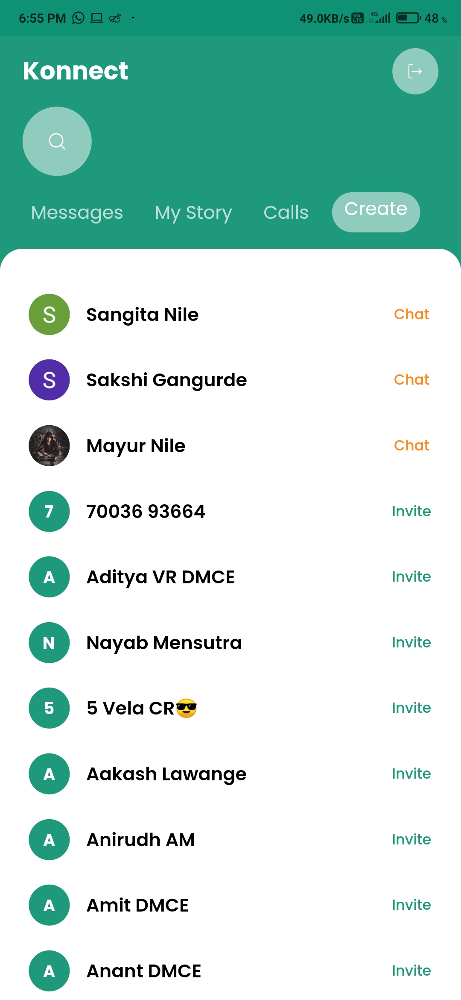

<div align="center"> 
    
    <h2 align="center"><b>Konnect</b></h2>
    <h3 align="center">
        Konnect with your friends!
    </h3>
</div>

<div align="center">
    <br><br>
    <h3 align="center">made</h3>
    
    <h3 align="center">
        <i>
        Implemented with Dart's Sound Null-Safety for stable, performant and efficient application
        </i>
    </h3>
    <br><br>
</div>

---

<div><br></div>

## Table of Contents
1.  About
1.  Built With
1.  Screenshots
1.  Try it Yourself
1.  How can you use it ?
    - Prerequisites
    - Usage
1. Contact


# About
#### Konnect is a social media app that seeks to mimic the features of other social media apps. It has a new appearance and syncs with your contacts, allowing you to see who else is on the platform and, of course, allowing you to chat with your friends in real time. It also makes use of Dart's newest feature, "Null-Safety."

<div><br><br></div>

# Built With
#### This application is built using Flutter, Firebase and Dart which is an underlying language which Flutter requires.

<div align="center" display="block">
<br>


</div>

<br><br></div>

# Screenshots
#### First this app was designed using Figma and then implemented using Flutter and Firebase

### Design File - [My Notes Design](https://www.figma.com/file/s3kAQrAKGjYz6su5iFqRcN/My-Notes?node-id=0%3A1)

### Here are the App Screenshots
- Login Screen
<br><br>


- Signup Screen
<br><br>


- Verify OTP Screen
<br><br>


- Home Screen
<br><br>


- Chat Screen
<br><br>


- Contacts Screen
<br><br>

<br><br>

# Try it Yourself
### You can try this app by installing it on your device. Here is the link for the app to download -> [Click here to Download!](https://drive.google.com/file/d/1foWcCPi19F17hNpw30V2XR07jh1Xioxb/view?usp=sharing)
<br><br>

# How can you use it ?
#### You need to follow this simple steps to execute this application locally on your machine

## Prerequisites
1. Flutter SDK must be installed -> [How to do it ?](https://flutter.dev/docs/get-started/install)
1. Basic knowledge of Flutter & Android


## Usage
1. Create a Firebase Project -> [Here](https://console.firebase.google.com/u/0/) 
1. Clone this repo and change package name -> [Here's the Guide](https://stackoverflow.com/questions/51534616/how-to-change-package-name-in-flutter)
1. Add your app to the Firebase project you created -> [This is how you do it!](https://firebase.google.com/docs/flutter/setup)
1. Download the "google-services.json" file after you get it
1. Place it in this folder ->
    ```
        <your project path>/android/app
    ```
1.  Execute the app!

<div><br><br></div>

# Contact
Mayur Nile - [Linkedin](https://www.linkedin.com/in/mayurnile/) - mayurnile95@gmail.com

Project Link: [https://github.com/mayurnile/konnect](https://github.com/mayurnile/konnect)